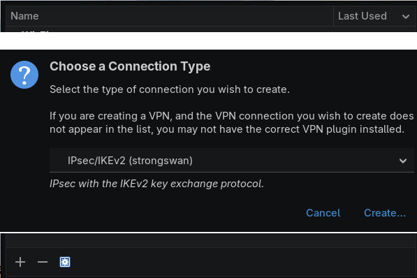
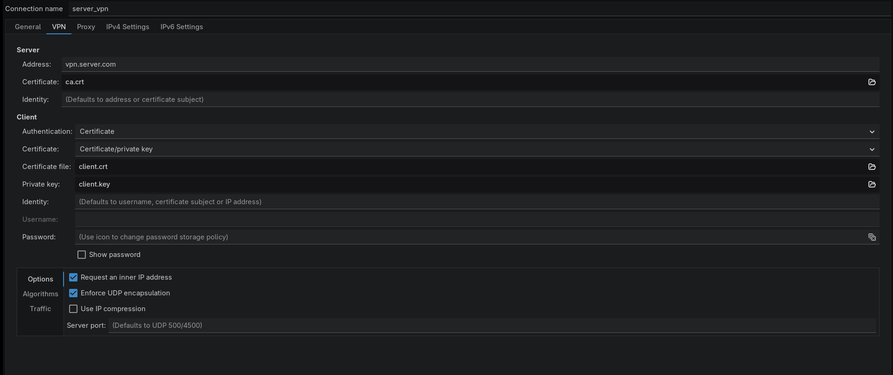
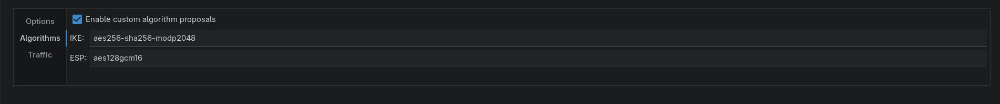
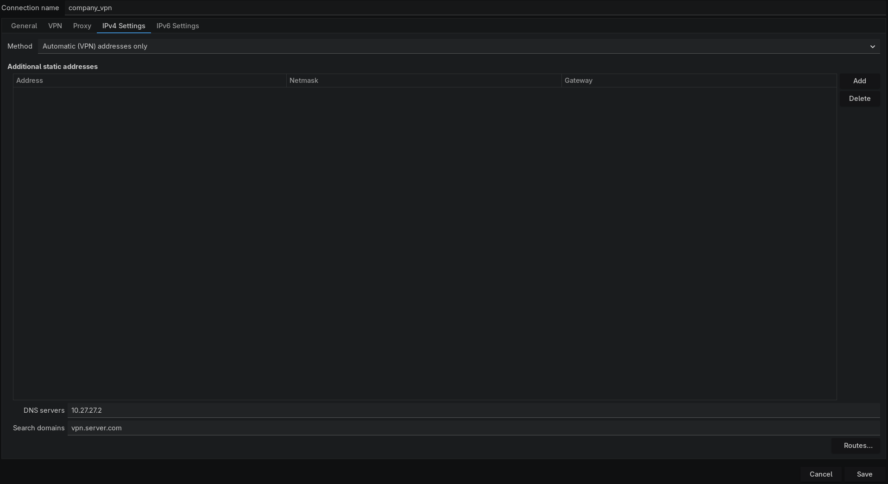
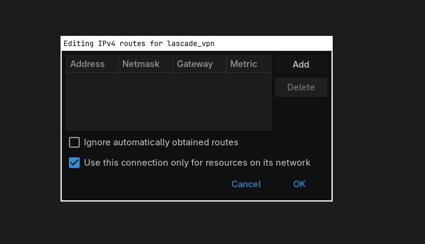

# Corporate IKEv2 VPN Setup Guide (Linux)

This guide documents how to manually configure a corporate IKEv2 VPN on Linux using a `.p12` file. These steps use **NetworkManager** and **strongSwan** to mirror the security configurations required by IKEv2 servers.

---

## 1. File Preparation
Your certificates are stored in `~/vpn`. To use them with NetworkManager, they must be extracted from the PKCS#12 (.p12) container.

1.  **Open your terminal:**
    `cd ~/vpn`
2.  **Extract the components:**
    * **CA Certificate:** `openssl pkcs12 -in yourfile.p12 -cacerts -nokeys -out ca.crt`
    * **User Certificate:** `openssl pkcs12 -in yourfile.p12 -clcerts -nokeys -out client.crt`
    * **Private Key:** `openssl pkcs12 -in yourfile.p12 -nocerts -nodes -out client.key`

---

## 2. Prerequisites
Install the IKEv2 plugin for NetworkManager.
* **Arch:** `sudo pacman -S networkmanager-strongswan strongswan`
* **Ubuntu/Debian:** `sudo apt install network-manager-strongswan libcharon-extra-plugins`
* **Fedora:** `sudo dnf install NetworkManager-strongswan-gnome`

---

## 3. Configuration Steps

### Step A: Basic Setup
1. Open **Network Settings**, click **+**, and select **IPsec/IKEv2 (strongswan)**.
2. **Gateway:** Enter the server address (e.g., `vpn.lascade.com`).
3. **Authentication:** Choose **Certificate/private key**.
4. **Certificates:** Link the files in `~/vpn` to the CA, User Certificate, and Private Key fields.





### Step B: Algorithm Proposals
To match Windows-style encryption (GCM-AES), click the **Algorithms** button and enter the following:

* **Phase 1 (IKE):** `aes256-sha256-modp2048`
* **Phase 2 (ESP):** `aes128gcm16`
* **Options:** Check **"Request an inner IP address"** and **"Enforce UDP encapsulation"**.




### Step C: DNS & Split Tunneling
1. Go to the **IPv4 Settings** tab.
2. Set **Method** to **Automatic (DHCP) addresses only**.
3. **DNS:** Enter your internal DNS IP (e.g., `10.27.27.2`).
4. **Routes:** Click **Routes...** and check **"Use this connection only for resources on its network"**.




---

## 4. Enabling DNS Resolution
On many Linux distributions, you must enable `systemd-resolved` to handle VPN DNS correctly.

```bash
# Start the service
sudo systemctl enable --now systemd-resolved

# Create the symlink for global DNS
sudo ln -sf /run/systemd/resolve/stub-resolv.conf /etc/resolv.conf
